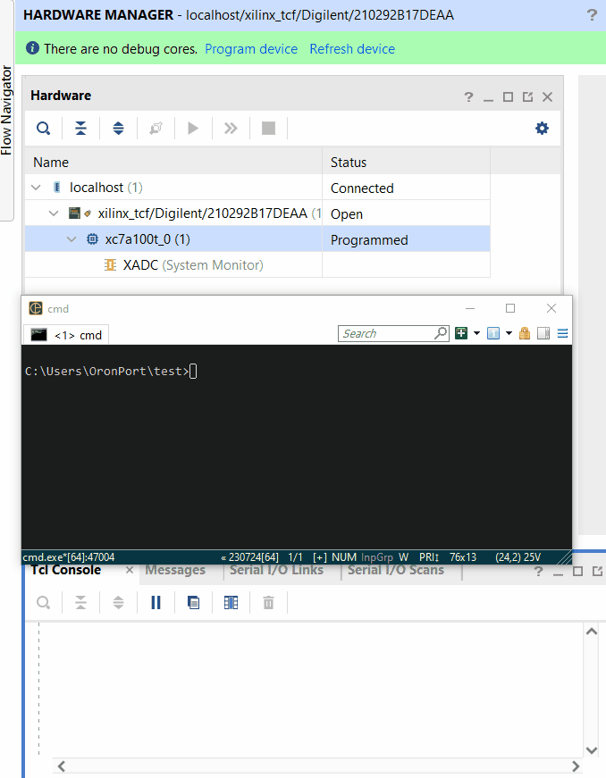
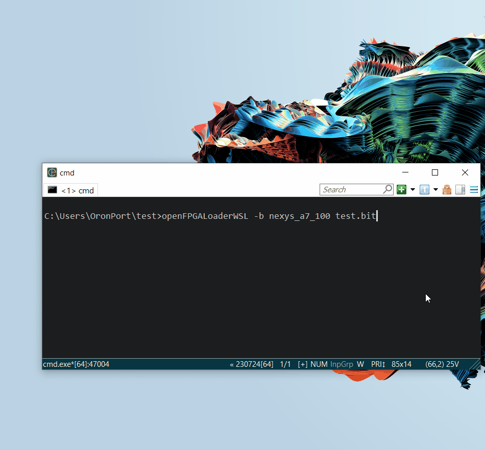

# openFPGALoader Windows/WSL Wrapper

This project provides Windows and [WSL](https://learn.microsoft.com/en-us/windows/wsl/install) wrapper scripts for [openFPGALoader](https://github.com/trabucayre/openFPGALoader) that automatically handle USB device attachment and detachment for FPGA USB programming devices (cables).

## Why is this needed?

openFPGALoader cannot work with standard Windows drivers because it's based on libusb. An alternative approach is to install openFPGALoader under [MSYS2](https://www.msys2.org/) and use [Zadig](https://zadig.akeo.ie/) to replace the standard drivers with WinUSB drivers. While this enables openFPGALoader to work, it breaks commercial tool support that relies on the standard drivers (e.g., Vivado Hardware Manager). If you're only programming FPGAs or their flash devices, this may not be an issue. However, if you want to use integrated logic analyzers that commercial tools provide, this method prevents you from doing so.

## openFPGALoaderWSL to the rescue!

The openFPGALoaderWSL script solves this problem by utilizing a simple WSL openFPGALoader installation and the [USBIPD-WIN project](https://learn.microsoft.com/en-us/windows/wsl/connect-usb#install-the-usbipd-win-project). After installation, simply call `openFPGALoaderWSL` with the same arguments as `openFPGALoader`, and everything is handled automatically for you.

In the following demo, you can see how Vivado Hardware Manager is temporarily disconnected from the programming cable while running `openFPGALoaderWSL`, and afterward it's perfectly able to use the programming cable as usual.



## Features

- **Use openFPGALoader Alongside Commercial Tools Under Windows**: No longer need to choose between the speed and productivity of openFPGALoader and the full features of commercial tools. You can have both!
- **Automatic USB Device Management**: Automatically detects and attaches USB programming devices to WSL
- **Cross-Platform**: Works seamlessly between Windows and WSL2
- **Error Handling**: Comprehensive error handling and cleanup

## Prerequisites

### Windows Requirements

1. **Windows 11** (Build 22000 or later) or **Windows 10** with WSL from Microsoft Store
2. **WSL2** installed and configured
3. **usbipd-win** installed on Windows

### WSL Requirements

1. **Linux distribution** (Ubuntu recommended)
2. **openFPGALoader** installed in WSL

## Installation

### In Windows

#### A. Install or update WSL2:
1. Open an *elevated* command prompt or PowerShell
2. To install (skip if already installed):
```cmd
wsl --install
```
3. To update (skip for fresh install):
```cmd
wsl --update
```

#### B. Install or update usbipd-win:
1. Open an *elevated* command prompt or PowerShell
2. To install (skip if already installed):
```cmd
winget install --exact dorssel.usbipd-win
```
3. To update (skip for fresh install):
```cmd
winget update --exact dorssel.usbipd-win
```

#### C. Clone this repository:
1. Open a *user-level* command prompt or PowerShell
2. Navigate to where you want to install openFPGALoaderWSL and run (this will create a folder named `openFPGALoaderWSL`):
```cmd
git clone https://github.com/DFiantWorks/openFPGALoaderWSL
```
3. Add the created folder to the Windows `PATH` environment variable.

### In WSL

#### 1. Install openFPGALoader
```bash
# Ubuntu/Debian
sudo apt update
sudo apt install openfpgaloader

# Or build from source
git clone https://github.com/trabucayre/openFPGALoader.git
cd openFPGALoader
mkdir build && cd build
cmake ..
make -j$(nproc)
sudo make install
```

#### 2. (Optional) Add openFPGALoaderWSL to your WSL `PATH`
If you only intend to run openFPGALoaderWSL from Windows, this step is not necessary. However, if you intend to call it directly within WSL, add the Windows mounted folder of openFPGALoaderWSL to the WSL path. For example, `/mnt/c/Users/Gizmo/openFPGALoaderWSL` is the path you would add.

## Usage

### Bind Cable Device (Once per cable)

For the first time with every different programming cable, you must first bind (share) the cable in an *elevated* PowerShell console. When you run `openFPGALoaderWSL`, it will detect cables that are not shared and print an error like this:

```
[ERROR] Cable (Bus ID: 2-1) is not shared and needs to be bound first
[ERROR] Please run the following command in an elevated (admin) PowerShell console:
[ERROR]   usbipd bind --busid 2-1
[ERROR] Then retry running openFPGALoaderWSL.
```

All you need to do is execute the `usbipd bind` command with the `busid` provided in the error message.

Here is a demo of this entire process:



### Basic Usage
```cmd
# Program to SRAM (volatile)
openFPGALoaderWSL -b nexys_a7_100 C:\path\to\your\bitstream.bit

# Program to flash (persistent)
openFPGALoaderWSL -b nexys_a7_100 -f C:\path\to\your\bitstream.mcs
```

For more help, visit https://trabucayre.github.io/openFPGALoader

## How It Works

1. **Windows Script (`openFPGALoaderWSL.bat`)**:
   - Converts Windows file paths to WSL paths
   - Calls the WSL script with converted arguments
   - Handles error reporting

2. **WSL Script (`openFPGALoaderWSL.sh`)**:
   - Detects FPGA programming cable USB devices using `usbipd list`
   - Attaches devices that appear in `cables.list` to WSL with `usbipd attach`
   - Runs `openFPGALoader` with provided arguments
   - Detaches devices when complete

## Supported Devices

Basically, all devices with known VID:PID numbers that are supported by openFPGALoader are supported by this script and appear in the `cables.list` file.

## Contributing

Feel free to submit issues and enhancement requests!

## References

- [openFPGALoader Documentation](https://trabucayre.github.io/openFPGALoader/)
- [openFPGALoader GitHub Repository](https://github.com/trabucayre/openFPGALoader)
- [Microsoft WSL Installation Guide](https://learn.microsoft.com/en-us/windows/wsl/install)
- [Microsoft WSL USB Device Guide](https://learn.microsoft.com/en-us/windows/wsl/connect-usb)
- [MSYS2](https://www.msys2.org/)
- [Zadig USB Driver Installation Tool](https://zadig.akeo.ie/)
- [usbipd-win Project](https://github.com/dorssel/usbipd-win)
